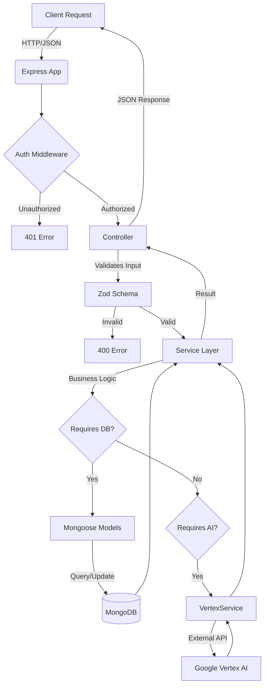
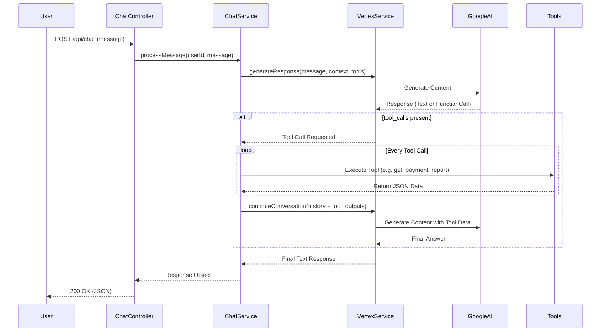

# Arquitectura del Backend - FinanzApp

Este documento describe la arquitectura detallada del backend de la aplicación FinanzApp. El sistema está construido utilizando **Node.js** con **TypeScript**, siguiendo una **Arquitectura en Capas (Layered Architecture)** para garantizar la separación de responsabilidades, mantenibilidad y escalabilidad.

## 🏗 Visión General

El backend expone una API RESTful que sirve como núcleo lógico para la aplicación financiera. Interactúa con una base de datos **MongoDB** y se integra con servicios de Inteligencia Artificial (**Google Vertex AI**) para el análisis y procesamiento de datos financieros.

### Tecnologías Principales
- **Runtime**: Node.js
- **Lenguaje**: TypeScript
- **Framework Web**: Express.js
- **Base de Datos**: MongoDB (con Mongoose ODM)
- **IA**: Google Vertex AI
- **Validación**: Zod
- **Autenticación**: JWT (JSON Web Tokens)

---

## 🏛 Estructura de Capas

El proyecto sigue una estructura estricta de capas, donde las dependencias fluyen hacia adentro o se inyectan mediante inyección de dependencias.

### 1. Capa de Presentación (`src/presentation`)
Responsable de manejar las interacciones HTTP. Recibe las peticiones, invoca la lógica de negocio y devuelve las respuestas formateadas.

- **Controllers**: Manejan los endpoints de la API.
  - `AuthController`: Registro e inicio de sesión.
  - `CategoryController`: Gestión de categorías de gastos.
  - `ServiceController`: Gestión de servicios recurrentes.
  - `PagoController`: Operaciones CRUD sobre pagos y reportes.
  - `CreditController`: Gestión de créditos y simulaciones.
  - `ImportController`: Manejo de importaciones masivas (CSV) y análisis con IA.
  - `DashboardController`: Agregación de datos para la vista principal.
  - `ChatController`: Interfaz para el asistente financiero con IA.

### 2. Capa de Aplicación (`src/application`)
Contiene la lógica de negocio y casos de uso. Orquesta las operaciones entre la capa de dominio y la infraestructura.

- **Services**: Implementan la regles de negocio.
  - `AuthService`: Lógica de autenticación y hashing de contraseñas.
  - `PagoService`: Cálculos de pagos, generación de reportes y estadísticas.
  - `CreditService`: Tablas de amortización, proyecciones y abonos.
  - `ImportService`: Procesamiento de archivos CSV, detección de patrones y mapeo automático mediante IA.
  - `AnalysisService`: Lógica pura de análisis financiero.
  - `ChatService`: Gestión del contexto y flujo de conversación con la IA.

### 3. Capa de Dominio (`src/domain`)
Define las entidades núcleo del negocio y los modelos de datos.

- **Entidades (Mongoose Models)**:
  - `User`: Usuarios del sistema.
  - `Category`: Categorías de gastos (ej: Hogar, Alimentación). Relación 1:N con Servicios y Pagos.
  - `Service`: Servicios recurrentes (ej: Netflix, Alquiler). Relación N:1 con Categorías.
  - `Pago`: Transacciones individuales. Relación N:1 con Servicios y Usuarios.
  - `Credit`: Préstamos o deudas, incluye configuración de tasas y plazos.
  - `Dashboard`: Cache o estructura de datos agregados (si aplica).

### 4. Capa de Infraestructura (`src/infrastructure`)
Implementaciones concretas de interfaces y comunicación con servicios externos.

- **AI Services**:
  - `VertexService`: Cliente para comunicar con la API de Google Vertex AI.
  - `AIServiceFactory`: Patrón fábrica para instanciar el servicio de IA.
- **Configuración de Base de Datos**: Conexión a MongoDB.

### 5. Integración con Inteligencia Artificial (`src/infrastructure/services` + `src/application/services`)

El sistema utiliza **Google Vertex AI** (anteriormente se refería a veces como OpenAI o Gemini en el código legado, pero estandarizado a Vertex) para proporcionar características inteligentes.

#### Componentes de IA:
1.  **`VertexService` (`src/infrastructure/services/VertexService.ts`)**:
    *   Implementa la interfaz `IOpenAIService`.
    *   Maneja la comunicación HTTP con la API de Google Vertex AI.
    *   **Métodos Principales**:
        *   `generateResponse(userId, message, context, tools)`: Inicia una conversación, inyectando el prompt del sistema y el contexto financiero.
        *   `continueConversation(userId, messages, tools)`: Maneja el seguimiento de la conversación, especialmente después de la ejecución de *Tools*.

2.  **`ChatService` (`src/application/services/ChatService.ts`)**:
    *   Orquestador entre el usuario y la IA.
    *   **Function Calling (Herramientas)**: Define y ejecuta herramientas que la IA puede invocar:
        *   `get_payment_report`: Obtiene gastos filtrados por mes/año.
        *   `get_anomalies`: Detecta gastos inusuales (>20% variación).
        *   `get_projections`: Pronostica gastos a 6 meses.
    *   **Flujo**: Usuario -> ChatService -> VertexService (Decisión) -> ChatService (Ejecuta Tool) -> VertexService (Respuesta Final).

3.  **`AnalysisService` (`src/application/services/AnalysisService.ts`)**:
    *   Provee la lógica determinística que consumen las herramientas de la IA.
    *   **`getAnomalies(userId)`**: Compara el gasto actual de cada servicio con su promedio histórico.
    *   **`getProjections(userId)`**: Calcula una línea base y aplica un factor de crecimiento para estimar gastos futuros.

4.  **Configuración de IA**:
    *   `src/constants/vertex.constants.ts`: Define el modelo (`gemini-2.5-flash-lite`), prompts del sistema y configuración de generación.
    *   `src/utils/vertex.utils.ts`: Mapeamos herramientas y respuestas entre el formato de la aplicación y el esperado por la API de Vertex.

---

## 🔄 Flujo de Datos y Relaciones

### Modelo de Datos (Relaciones Clave)

1.  **User**: Entidad raíz.
    *   Tiene muchas `Categories`, `Services`, `Pagos`, `Credits`.
2.  **Category**:
    *   Pertenece a un `User`.
    *   Tiene muchos `Services`.
3.  **Service**:
    *   Pertenece a una `Category` y a un `User`.
    *   Tiene muchos `Pagos` (historial de pagos de ese servicio).
4.  **Pago**:
    *   Pertenece a un `Service` (opcionalmente) y a un `User`.
    *   Registra fecha, monto y estado.
5.  **Credit**:
    *   Independiente de servicios/categorías, vinculado al `User`.
    *   Contiene sub-documentos o referencias para los `Abonos`.

### Flujo de Importación Inteligente
1.  **Frontend** envía archivo CSV o filas pre-procesadas al `ImportController`.
2.  **ImportController** delega al `ImportService`.
3.  **ImportService**:
    *   Normaliza los datos.
    *   Llama a `VertexService` para analizar descripciones y sugerir categorías/servicios.
    *   Devuelve un análisis con confianza (scores) y sugerencias.

---

## 🛠 Utilidades Clave (`src/utils`)

- **`OwnershipValidator`**:
    *   Una clase estática crítica para la seguridad y consistencia.
    *   Centraliza la lógica de validación de propiedad: "¿El usuario X es realmente dueño del recurso Y?".
    *   Métodos: `validateServiceAndCategory`, `validatePagoOwnership`, `validateCategoryOwnership`, `validateCreditOwnership`.
    *   Evita la duplicación de código `if (!found) ... if (userId !== owner) ...` en los controladores.

- **`vertex.constants.ts` / `vertex.utils.ts`**:
    *   Configuraciones y helpers para interactuar con la IA de maneja estructurada.

## 💉 Inyección de Dependencias (`src/di`)

El proyecto utiliza un contenedor de dependencias (`Container.ts`) para instanciar servicios y controladores, facilitando el testing y el desacoplamiento.

---

## 🚀 Puntos de Entrada

- **`index.ts`**: Punto de entrada de la aplicación.
    *   Inicializa la conexión a BD.
    *   Configura middleware (CORS, JSON parser).
    *   Define las rutas base `/api/...`.
    *   Inicia el servidor Express.

### 6. Diagramas de Flujo

#### Flujo General de Petición HTTP

#### Flujo de Interacción con Asistente IA

