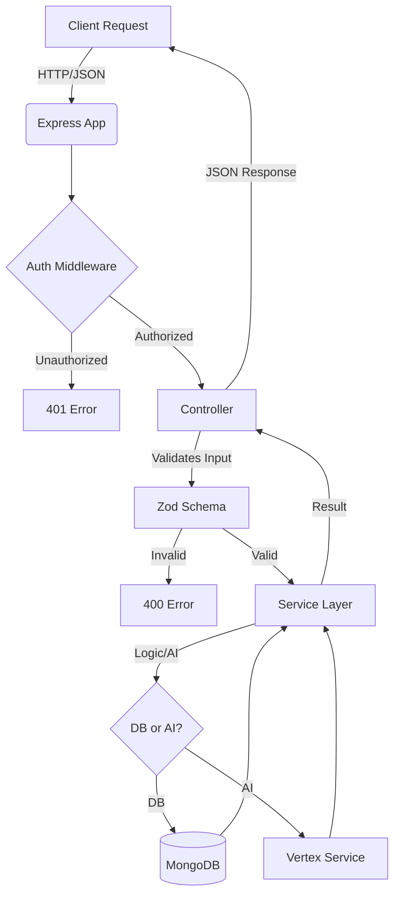

# Finanzas Backend - FinanzApp

Backend API for the FinanzApp personal finance management application. Built with Node.js, Express, TypeScript, and MongoDB, featuring AI integration via Google Vertex AI.

## 📚 Architecture

This project follows a **Layered Architecture** with strict separation of concerns, ensuring scalability and maintainability.

**[👉 Read the Full Architecture Documentation](BACKEND_ARCHITECTURE.md)**

### Key Layers:
1.  **Presentation (`src/presentation`)**: Express controllers handling HTTP requests using Zod for validation.
2.  **Application (`src/application`)**: Services containing business logic (Payments, Credits, Analysis, AI Chat).
3.  **Domain (`src/domain`)**: Core entities (User, Category, Service, Payment) and repository interfaces.
4.  **Infrastructure (`src/infrastructure`)**: Mongoose models, database connections, and external service clients (Vertex AI).

### 🧠 AI Integration (Vertex AI)

The backend integrates with **Google Vertex AI** to provide smart features:
- **Smart Import**: Automatically categorizes transactions from bank CSVs.
- **Financial Assistant**: A chat interface that can query your financial data, detect anomalies, and generate projections using "Function Calling".

### 📊 System Flow



## 🛠 Project Structure

```
src/
├── application/     # Business logic & use cases (Services)
├── constants/       # Configuration constants (Vertex AI, etc.)
├── di/              # Dependency Injection Container
├── domain/          # Entities & Repository Interfaces
├── infrastructure/  # DB Models & External Services (VertexService)
├── presentation/    # Controllers & Routes
└── utils/           # Shared utilities (OwnershipValidator, etc.)
```

## 🚀 Getting Started

1.  **Install dependencies**:
    ```bash
    pnpm install
    ```

2.  **Configure Environment**:
    Create a `.env` file with:
    ```env
    PORT=3000
    MONGO_URI=mongodb://localhost:27017/finanzapp
    JWT_SECRET=your_jwt_secret
    VERTEX_API_KEY=your_google_cloud_api_key
    VERTEX_MODEL=gemini-2.5-flash-lite
    ```

3.  **Start Development Server**:
    ```bash
    pnpm dev
    ```

## 🧪 Testing

Run strict type checks:
```bash
pnpm type-check
```
